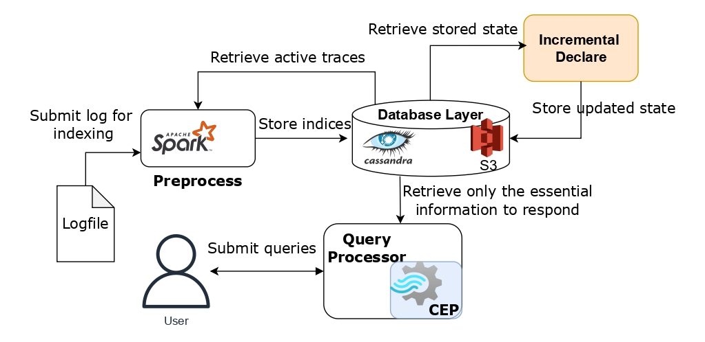

# SIESTA Preprocess Component

[//]: # (General idea for siesta -> image of the whole system - describe it  some interesting results)
#### SIESTA is a highly scalable infrastructure designed for performing pattern analysis in large volumes of event logs.

### Architecture overview


The architecture of SIESTA consists of two main components: the preprocessing component and the query processor.
The preprocessing component (implemented in this repo) is responsible for handling continuously arriving logs and 
computing the appropriate indices, while the [query processor](https://github.com/mavroudo/SequenceDetectionQueryExecutor)
utilizes the stored indices to perform efficient pattern analysis. Pattern analysis consists of both pattern 
detection and pattern exploration. Our complete work can be found [here](https://ieeexplore.ieee.org/document/9984935).

### Preprocess Component
This module processes the provided logfile using Apache Spark, a framework specifically designed for big data projects, 
and stores the indices into scalable databases such as Apache Cassandra and S3. The primary index, named IndexTable, 
is an inverted index where the key represents an event pair, and the value is a list of all traces that contain this pair, 
along with their corresponding timestamps. Additionally, there are other indices that contain useful information, 
such as statistics for each pair and the timestamp of the last completed pair, enabling different processes. 
A comprehensive list of all tables and their structures can be found in our published work.

In addition to the preprocess component of SIESTA, we have implemented two additional indexing methods, 
namely Signature and Set-Containment, which are supported by the underlying framework.
This means that they utilize both Apache Spark and the scalable database to efficiently generate their indices.
SIESTA's performance has been evaluated against these methods.

Finally, it's important to note that although our case study uses log files from the Business Process Management field, 
the solution is generic and can be applied to any log file (provided a connector is implemented) 
as long as the events contain an event type, a timestamp, and correspond to a specific sequence or trace.


### Getting Started with Docker
Using Docker makes it easy to deploy the preprocess component. The following steps will guide you on how to run the component 
for randomly generated event sequences using local Spark and a database (all Dockerfiles are provided). 
Once you have tested the successful build and execution, we will provide further instructions on how to execute 
the preprocess component for a provided logfile using an already running Spark cluster or a deployed database.
#### Requirements
- docker
- docker-compose

1. **Create network:** In order for all the components to communicate they have to belong to the same network. Create
a new network using the following command:
```bash
docker network create --driver=bridge  siesta-net
```

2. **Deploy database:** From the root directory execute the following commands:
```bash
docker-compose -f dockerbase/docker-compose-s3.yml up -d
```   
for the S3

```bash
docker-compose -f dockerbase/docker-compose-cassabdra.yml up -d
```  
for the Cassandra. The database will be deployed locally, opening the default ports and then it will be
detached.

If you decide to use S3, you have to create a new bucket named "**siesta**" before proceeding to the next step. To do that
login to http://localhost:9000 using for both username and password **minioadmin** (default option for minio). Click on
**Buckets** from the left and then press **Create Bucket**. Use the default settings.

3. **Build Docker image:** From the root directory run the following command:
```bash
docker build -t preprocess -f dockerbase/Dockerfile .
```
This will download all the dependencies, build the jar file and finally download the spark component. The image is now
ready to be executed.

4. **Run image:** After image was built it can be run with the 
```bash
docker run --network siesta-net preprocess
```

if S3 is utilized or
```bash
docker run --network siesta-net preprocess -d cassandra
``` 
for Cassandra. The default execution will  generate 200 synthetic traces, 
using 10 different event types, and lengths that vary from 10 to 90 events. The inverted indices will be stored
using "test" as the logname.

### Connection preprocess component with preexisting resources
Connecting to already deployed databases or utilizing a spark cluster can be easily achieved with the use 
of parameters. The only thing that you should make sure is that their urls are accessible
by the docker container. this can be done by either making the url publicly available or by connecting the
docker container in the same network (as done above with the siesta-net).
- **Connect with spark cluster:** Change the value of the "**--master**" parameter in the ENTRYPOINT of the 
Dockerfile from "**local[*]**" to the resource manager's url. 
- **Connect with Cassandra:** Change the values environmental parameters that start with **cassandra\_**. 
These parameters include the contact point and the credentials required to achieve connection.
- **Connect with S3:** Change the values environmental parameters that start with **s3**.
   These parameters include the contact point and the credentials required to achieve connection.

At the end build the image again before executing it.

### Executing preprocess for a provided logfile
Till now the supported file extensions are "**.xes**", which are the default file for the Business Process
Management logfiles and "**.withTimestamp**", which is a generic file format generated for testing. A new
connector can be easily implemented in the _auth.datalab.siesta.BusinessLogic.IngestData.ReadLogFile_. 

In order to execute the preprocess for a provided logfile you need to take 2 steps. First ensure that the
logfile is visible inside the docker container and second execute the preprocessing with the appropriate
parameters. Therefore, place the logfile you want to preprocess inside the _experiments/input_ file. 
Assuming that the logfile is named "log.xes" and the indices should have the name "log" run the following
command from the root directory:
```bash
docker run  --mount type=bind,source="$(pwd)"/experiments/input,target=/app/input \
  preprocess -f /input/log.xes --logname log
```


### Complete list of parameters:
```
  --system <system>        System refers to the system that will be used for indexing
  -d, --database <database>
                           Database refers to the database that will be used to store the index
  -m, --mode <mode>        Mode will determine if we use the timestamps or positions in indexing
  -c, --compression <compression>
                           Compression determined the algorithm that will be used to compress the indexes
  -f, --file <file>        If not set will generate artificially data
  --logname <logname>      Specify the name of the index to be created. This is used in case of incremental preprocessing
  --delete_all             cleans all tables in the keyspace
  --delete_prev            removes all the tables generated by a previous execution of this method
  --join                   merges the traces with the already indexed ones
  --lookback <value>       How many days will look back for completions (default=30)
  -s, --split_every_days s
                           Split the inverted index every s days (default=30)

The parameters below are used if the file was not set and data will be randomly generated
  -t, --traces <#traces>
  -e, --event_types <#event_types>
  --lmin <min length>
  --lmax <max length>
  --help                   prints this usage text

```